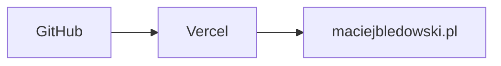

# maciejbledowski.pl

**Technical portfolio bringing together professional experience, software projects, homelab documentation and career information.**

[](https://nextjs.org/)
[](https://www.typescriptlang.org/)
[](https://tailwindcss.com/)
[](https://maciejbledowski.pl)

---

## Live Demo

https://maciejbledowski.pl

Explore the production version of the portfolio.

---

## Overview

A full-featured technical portfolio designed for IT professionals. More than a personal website — it serves as a central hub for showcasing active projects, documenting self-hosted infrastructure, and presenting professional experience in a format that goes beyond a traditional CV.

---

## Features

- Responsive design with dark theme
- Dedicated project pages (HireMate, HomeLab)
- Interactive HomeLab architecture diagram
- English and Polish CV with online view and PDF download
- SEO optimized with Open Graph metadata
- Modern component-based architecture with TypeScript

---

## Technology Stack

| Category | Technology |
|----------|-----------|
| Framework | Next.js 14 (App Router) |
| Language | TypeScript |
| Styling | Tailwind CSS |
| Hosting | Vercel |
| Analytics | Vercel Analytics |

---

## Getting Started

### Installation

```bash
git clone https://github.com/PlagueOnLinux/portfolio.git
cd portfolio
npm install
```

### Development

```bash
npm run dev
```

Open [http://localhost:3000](http://localhost:3000) in your browser.

### Production

```bash
npm run build
npm run start
```

---

## Project Structure

```
src/
├── app/
│   ├── hiremate/
│   ├── homelab/
│   ├── cv/
│   ├── projects/
│   └── contact/
├── components/
├── data/
└── context/
```

---

## Deployment



Every push to `main` triggers an automatic production deployment.

---

## Roadmap

- [x] Homepage with professional hero section
- [x] Dedicated project pages
- [x] Interactive HomeLab architecture diagram
- [x] CV page with language selection
- [x] Contact page with clipboard integration
- [ ] Blog / technical notes
- [ ] Case studies

---

## License

[MIT](LICENSE)

---

## Author

**Maciej Błędowski**

IT Support Engineer

- [Website](https://maciejbledowski.pl)
- [LinkedIn](https://linkedin.com/in/maciejbledowski)
- [GitHub](https://github.com/PlagueOnLinux)
- [Email](mailto:bledowskimaciej@gmail.com)

---

## Project Philosophy

This repository is maintained as a long-term project rather than a one-time portfolio. It evolves alongside my professional experience, software projects, and self-hosted infrastructure, serving as a central place to document my technical work and continuous learning.
